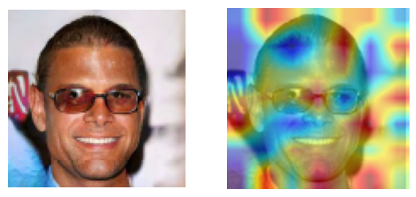
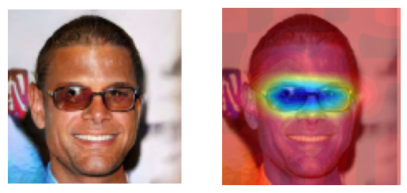
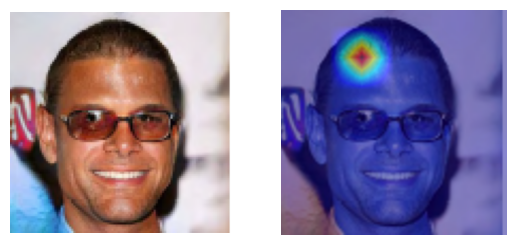
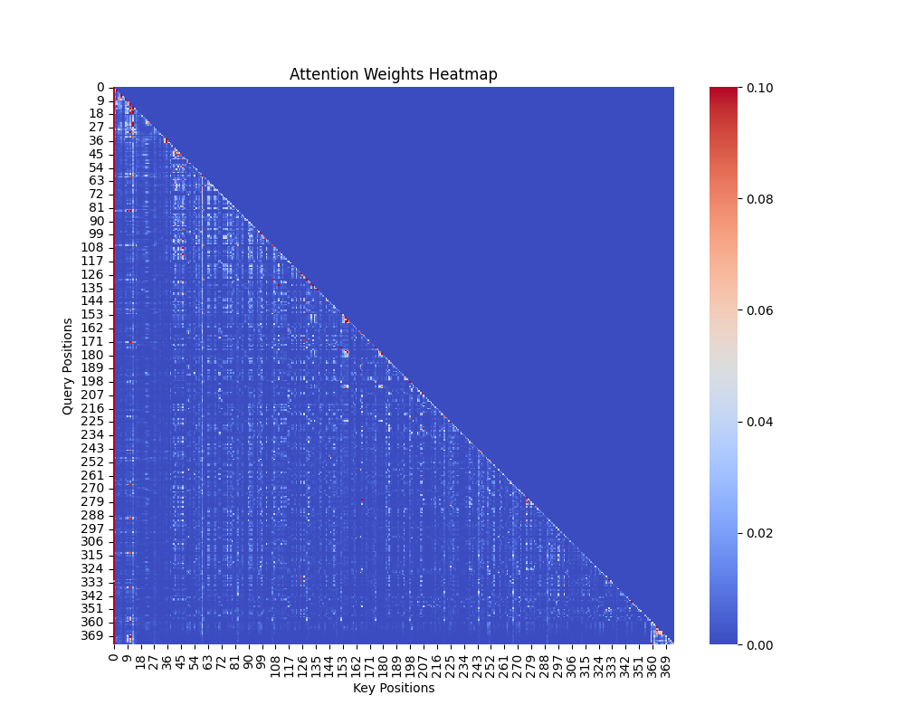
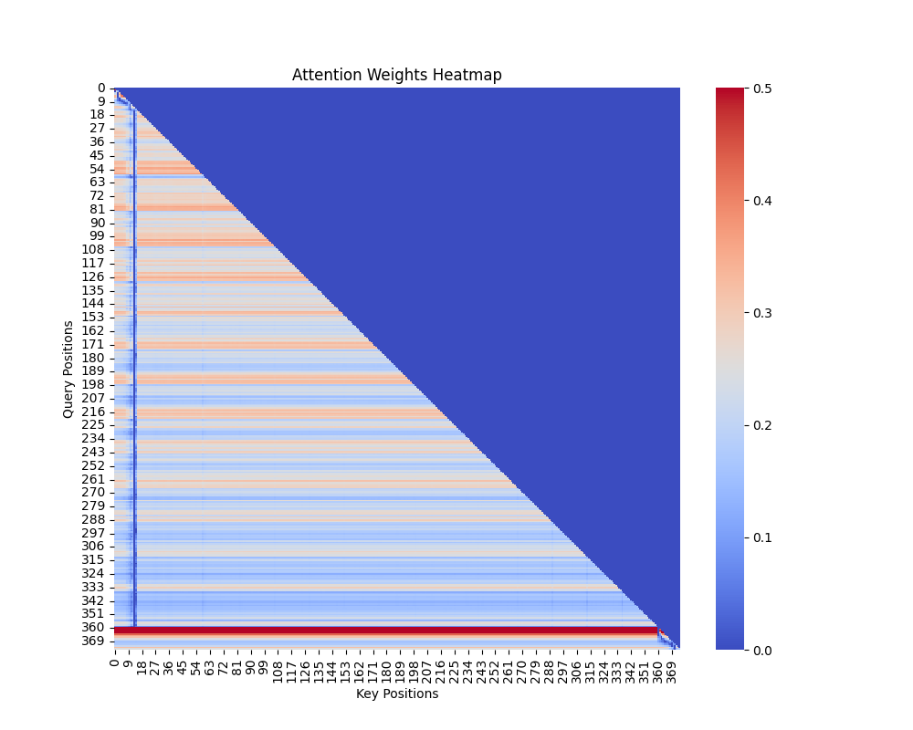
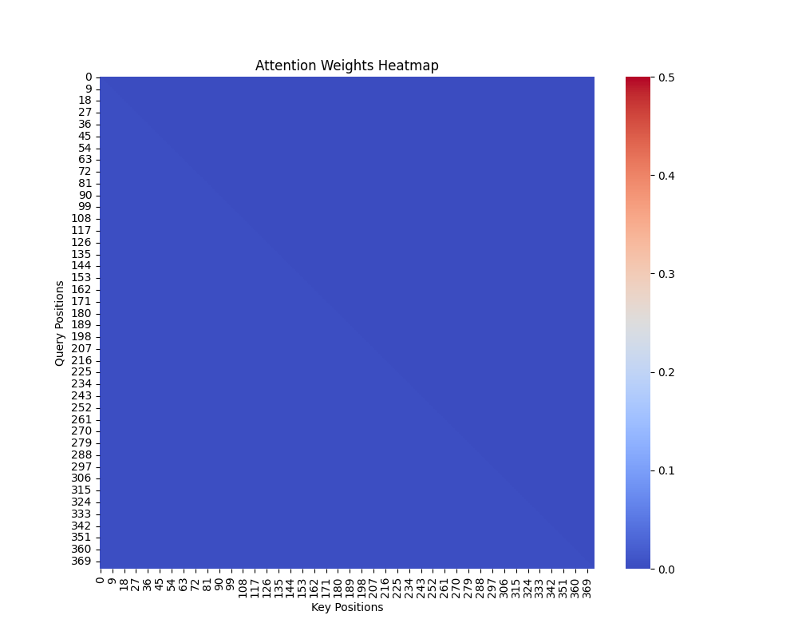
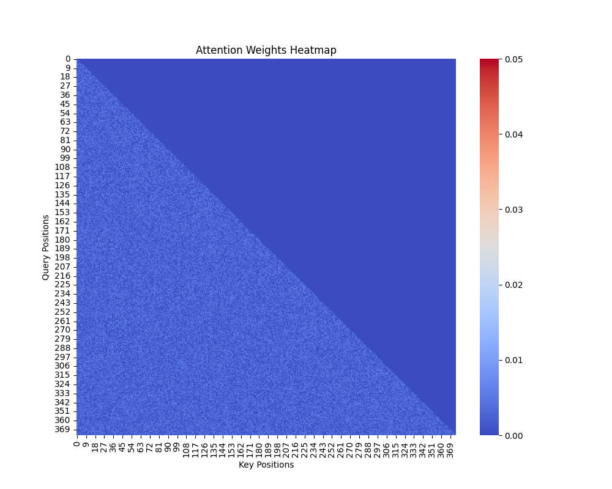

## [ICLR'25] Mitigating Modality Prior-Induced Hallucinations in Multimodal Large Language Models via Deciphering Attention Causality
<p align="center" width="100%">
<a target="_blank"></a>
</p>

The official repo for CausalMM, a plug-and-play method for deciphering attention causality in MLLMs. 
Full paper can be found at: [https://arxiv.org/abs/2410.04780](https://arxiv.org/abs/2410.04780).

<div style='display:flex; gap: 0.25rem; '>
<a href='https://arxiv.org/pdf/2410.04780'></a>
<a href='LICENCE'></a>
</div>

## 🗓 To-Do List
- [ ] Full code release
- [x] Key code for editing attention released
- [x] Preprint of the paper released, check it [here](https://arxiv.org/abs/2410.04780)

## Introduction
Multimodal Large Language Models (MLLMs) have emerged as a central focus in both industry and academia, but often suffer from biases introduced by visual and language priors, which can lead to multimodal hallucination. These biases arise from the visual encoder and the Large Language Model (LLM) backbone, affecting the attention mechanism responsible for aligning multimodal inputs. Existing decoding-based mitigation methods focus on statistical correlations and overlook the causal relationships between attention mechanisms and model output, limiting their effectiveness in addressing these biases. To tackle this issue, we propose a causal inference framework termed CausalMM that applies structural causal modeling to MLLMs, treating modality priors as a confounder between attention mechanisms and output. Specifically, by employing backdoor adjustment and counterfactual reasoning at both the visual and language attention levels, our method mitigates the negative effects of modality priors and enhances the alignment of MLLM's inputs and outputs, with a maximum score improvement of 65.3% on 6 VLind-Bench indicators and 164 points on MME Benchmark compared to conventional methods. Extensive experiments validate the effectiveness of our approach while being a plug-and-play solution.

## Structural Causal Model
<p align="center" width="100%">
<a target="_blank"></a>
</p>

## Environment Setup
```
cd env
conda env create -f causalmm_llava.yml
conda activate causalmm_llava.yml
```
You can build the LLaVA-1.5 environment following [this link](https://github.com/DAMO-NLP-SG/VCD).

## Counterfactual Attention

### Vision Counterfactual Attention

#### Code Sample

```
def edit_attention(self, attention_maps, method='shuffle'):
      batch_size, num_heads, height, width = attention_maps.shape　#depends on how the vision encoder extracts attention

      if method == 'random':
            edited_attention_maps = torch.rand(batch_size, num_heads, height, width, device=attention_maps.device) * 2

      elif method == 'uniform':
            avg_value = torch.mean(attention_maps, dim=(2, 3), keepdim=True)
            edited_attention_maps = avg_value.expand(batch_size, num_heads, height, width)

      elif method == 'reversed':
            max_value_height, _ = torch.max(attention_maps, dim=2, keepdim=True)
            max_value, _ = torch.max(max_value_height, dim=3, keepdim=True)

            edited_attention_maps = max_value - attention_maps

      elif method == 'shuffle':
            edited_attention_maps = attention_maps.clone()
            for i in range(num_heads):
                  edited_attention_maps[:, i] = edited_attention_maps[:, i].view(batch_size, -1).gather(1, torch.randperm(height * width, device=attention_maps.device).expand(batch_size, -1)).view(batch_size, height, width)

      else:
            raise ValueError("Invalid method. Choose from ['random', 'uniform', 'reversed', 'shuffle']")

            return edited_attention_maps
```
The complete experimental code can be found in [cf_encoder](llava-1.5/cf_encoder.py).

#### Visualization of Vision Counterfactual Attention

<table>
    <tr>
        <td align="center">
            <a target="_blank"></a>
            <br>random
        </td>
        <td align="center">
            <a target="_blank"></a>
            <br>reverse
        </td>
    </tr>
    <tr>
        <td align="center">
            <a target="_blank"></a>
            <br>uniform
        </td>
        <td align="center">
            <a target="_blank"></a>
            <br>shuffle
        </td>
    </tr>
</table>

### LLM Counterfactual Attention

#### Code Sample

```
def create_attention_mask(attention):
      bsz, num_heads, seq_len, _ = attention.size() #depends on the LLM decoder
      mask = torch.triu(torch.ones(seq_len, seq_len), diagonal=1).to(attention.device)  
      return mask.unsqueeze(0).unsqueeze(0).expand(bsz, num_heads, -1, -1)  

def reverse_attention(attention):
      attention_mask = create_attention_mask(attention)
      max_values = attention.max(dim=-1, keepdim=True)[0]
      reversed_attention = max_values - attention
      reversed_attention = reversed_attention * (1 - attention_mask)  
      return reversed_attention

def normalize_attention(attention):
      attention_mask = create_attention_mask(attention)
      normalized_attention = attention / attention.sum(dim=-1, keepdim=True)
      normalized_attention = normalized_attention * (1 - attention_mask)  
      return normalized_attention

def reverse_and_normalize_attention(attention):
      reversed_attention = reverse_attention(attention)
      normalized_reversed_attention = normalize_attention(reversed_attention)
      return normalized_reversed_attention

def random_attention(attention):
      attention_mask = create_attention_mask(attention)
      random_attention = torch.rand_like(attention)
      normalized_random_attention = normalize_attention(random_attention)
      normalized_random_attention = normalized_random_attention * (1 - attention_mask)  
      return normalized_random_attention

def uniform_attention(attention):
      attention_mask = create_attention_mask(attention)
      uniform_attention = torch.ones_like(attention) / attention.size(-1)
      uniform_attention = uniform_attention * (1 - attention_mask)  
      return uniform_attention

def apply_counterfactual_attention(attention, method):
      if method == 'reverse':
            return reverse_attention(attention)
      elif method == 'reverse_and_normalize':
            return reverse_and_normalize_attention(attention)
      elif method == 'random':
            return random_attention(attention)
      elif method == 'uniform':
            return uniform_attention(attention)
      else:
            raise ValueError(f"Unknown method: {method}")
```

You can insert it directly in the modeling_qwen2_vl.py file of the [transformers](https://github.com/huggingface/transformers).

#### Visualization of LLM Counterfactual Attention

<table>
    <tr>
        <td align="center">
            <a target="_blank"></a>
            <br>normal
        </td>
        <td align="center">
            <a target="_blank"></a>
            <br>reverse
        </td>
        <td align="center">
            <a target="_blank"></a>
            <br>uniform
        </td>
        <td align="center">
            <a target="_blank"></a>
            <br>random
        </td>
    </tr>
</table>

## Modality Priors
If you want to learn more about the work on modal priors, click [here](https://github.com/The-Martyr/Awesome-Modality-Priors-in-MLLMs).

## Citation
Welcome to star our repo and cite our work:
```
@article{zhou2024mitigating,
  title={Mitigating Modality Prior-Induced Hallucinations in Multimodal Large Language Models via Deciphering Attention Causality},
  author={Zhou, Guanyu and Yan, Yibo and Zou, Xin and Wang, Kun and Liu, Aiwei and Hu, Xuming},
  journal={arXiv preprint arXiv:2410.04780},
  year={2024}
}
```

## Acknowledgement
* [LLaVA](https://github.com/haotian-liu/LLaVA): Large Language and Vision Assistant
* [Qwen2-VL](https://github.com/QwenLM/Qwen2-VL): Enhancing Vision-Language Model’s Perception of the World at Any Resolution
* [VCD](https://github.com/DAMO-NLP-SG/VCD): Mitigating Object Hallucinations in Large Vision-Language Models through Visual Contrastive Decoding
* [OPEAR](https://github.com/shikiw/OPERA?tab=readme-ov-file): Alleviating Hallucination in Multi-Modal Large Language Models via Over-Trust Penalty and Retrospection-Allocation

