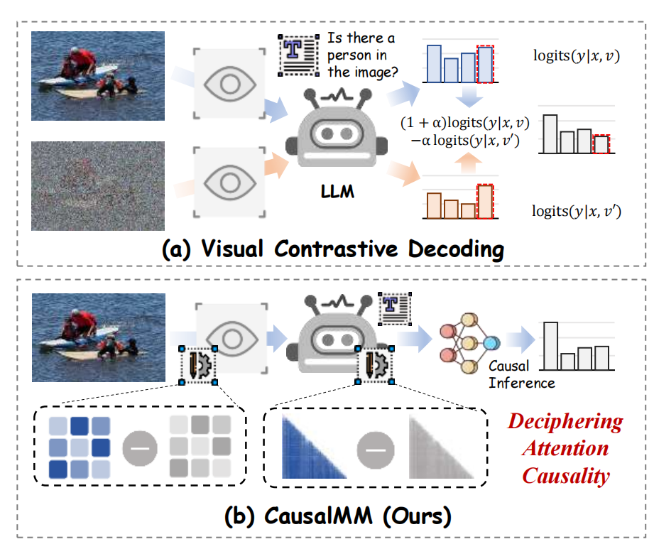

## [ICLR 2025] Mitigating Modality Prior-Induced Hallucinations in Multimodal Large Language Models via Deciphering Attention Causality
<p align="center" width="100%">
<a target="_blank"></a>
</p>

The official repo for CausalMM, a plug-and-play method for deciphering attention causality in MLLMs. 
Full paper can be found at: [https://arxiv.org/abs/2410.04780](https://arxiv.org/abs/2410.04780).

<div style='display:flex; gap: 0.25rem; '>
<a href='https://arxiv.org/pdf/2410.04780'></a>
<a href='LICENCE'></a>
</div>

## 🗓 To-Do List
- ✅ English version of the introduction video: [ICLR](https://iclr.cc/virtual/2025/poster/30629)
- ✅ The video talk (Chinese version) is now public, check it on [bilibili](https://www.bilibili.com/video/BV1YkRAYVEHy/?spm_id_from=333.1007.top_right_bar_window_default_collection.content.click&vd_source=ffc139b7b13aa7195dd7b37795efa6a9)
- ✅ Full code release (llava with vision)
- ✅ Key code for editing attention released
- ✅ Preprint of the paper released, check it [here](https://arxiv.org/abs/2410.04780)

## Intro
We propose a framework called **CausalMM** to help MLLM/LVLM alleviate the multimodal hallucination caused by prior knowledge of visual, language and other modalities, with a maximum score improvement of 65.3% on 6 VLind-Bench indicators and 164 points on MME Benchmark compared to conventional methods.

## Poster
<p align="center" width="100%">
<a target="_blank"></a>
</p>

## Environment Setup
```
cd env
conda env create -f causalmm_llava.yml
conda activate causalmm_llava.yml
```
Or you can simply build the LLaVA-1.5 environment following [VCD](https://github.com/DAMO-NLP-SG/VCD).

## Run CausalMM

### POPE

1. Download POPE bench ([COCO2014](https://huggingface.co/datasets/HuggingFaceM4/COCO) / [AOKVQA](https://huggingface.co/datasets/HuggingFaceM4/A-OKVQA) to Dir CausalMM (like CausalMM/COCO/val2014).

2. Download [LLaVA-v1.5-7b](https://huggingface.co/liuhaotian/llava-v1.5-7b) to Dir CausalMM (like CausalMM/llava-v1.5-7b).

3. Run the script (with one GPU <default 0>).
```
conda activate causalmm_llava
cd llava-1.5/experiments/scripts
CUDA_VISIBLE_DEVICES=0 bash llava1.5_eval.bash
```
For MME Bench, switch to this [file](llava-1.5/experiments/eval/object_hallucination_vqa_llava_mme.py).

## Structural Causal Model
<p align="center" width="100%">
<a target="_blank"></a>
</p>

## Counterfactual Attention

### Vision Counterfactual Attention

#### Code Sample

```
def edit_attention(self, attention_maps, method='shuffle'):
      batch_size, num_heads, height, width = attention_maps.shape　#depends on how the vision encoder extracts attention

      if method == 'random':
            edited_attention_maps = torch.rand(batch_size, num_heads, height, width, device=attention_maps.device) * 2

      elif method == 'uniform':
            avg_value = torch.mean(attention_maps, dim=(2, 3), keepdim=True)
            edited_attention_maps = avg_value.expand(batch_size, num_heads, height, width)

      elif method == 'reversed':
            max_value_height, _ = torch.max(attention_maps, dim=2, keepdim=True)
            max_value, _ = torch.max(max_value_height, dim=3, keepdim=True)

            edited_attention_maps = max_value - attention_maps

      elif method == 'shuffle':
            edited_attention_maps = attention_maps.clone()
            for i in range(num_heads):
                  edited_attention_maps[:, i] = edited_attention_maps[:, i].view(batch_size, -1).gather(1, torch.randperm(height * width, device=attention_maps.device).expand(batch_size, -1)).view(batch_size, height, width)

      else:
            raise ValueError("Invalid method. Choose from ['random', 'uniform', 'reversed', 'shuffle']")

            return edited_attention_maps
```
The complete experimental code can be found in [cf_encoder](llava-1.5/cf_encoder.py).

#### Visualization of Vision Counterfactual Attention

<table>
    <tr>
        <td align="center">
            <a target="_blank"></a>
            <br>random
        </td>
        <td align="center">
            <a target="_blank"></a>
            <br>reverse
        </td>
    </tr>
    <tr>
        <td align="center">
            <a target="_blank"></a>
            <br>uniform
        </td>
        <td align="center">
            <a target="_blank"></a>
            <br>shuffle
        </td>
    </tr>
</table>

### LLM Counterfactual Attention

#### Code Sample

```
def create_attention_mask(attention):
      bsz, num_heads, seq_len, _ = attention.size() #depends on the LLM decoder
      mask = torch.triu(torch.ones(seq_len, seq_len), diagonal=1).to(attention.device)  
      return mask.unsqueeze(0).unsqueeze(0).expand(bsz, num_heads, -1, -1)  

def reverse_attention(attention):
      attention_mask = create_attention_mask(attention)
      max_values = attention.max(dim=-1, keepdim=True)[0]
      reversed_attention = max_values - attention
      reversed_attention = reversed_attention * (1 - attention_mask)  
      return reversed_attention

def normalize_attention(attention):
      attention_mask = create_attention_mask(attention)
      normalized_attention = attention / attention.sum(dim=-1, keepdim=True)
      normalized_attention = normalized_attention * (1 - attention_mask)  
      return normalized_attention

def reverse_and_normalize_attention(attention):
      reversed_attention = reverse_attention(attention)
      normalized_reversed_attention = normalize_attention(reversed_attention)
      return normalized_reversed_attention

def random_attention(attention):
      attention_mask = create_attention_mask(attention)
      random_attention = torch.rand_like(attention)
      normalized_random_attention = normalize_attention(random_attention)
      normalized_random_attention = normalized_random_attention * (1 - attention_mask)  
      return normalized_random_attention

def uniform_attention(attention):
      attention_mask = create_attention_mask(attention)
      uniform_attention = torch.ones_like(attention) / attention.size(-1)
      uniform_attention = uniform_attention * (1 - attention_mask)  
      return uniform_attention

def apply_counterfactual_attention(attention, method):
      if method == 'reverse':
            return reverse_attention(attention)
      elif method == 'reverse_and_normalize':
            return reverse_and_normalize_attention(attention)
      elif method == 'random':
            return random_attention(attention)
      elif method == 'uniform':
            return uniform_attention(attention)
      else:
            raise ValueError(f"Unknown method: {method}")
```

You can insert it directly in the modeling_qwen2_vl.py file of the [transformers](https://github.com/huggingface/transformers).

#### Visualization of LLM Counterfactual Attention

<table>
    <tr>
        <td align="center">
            <a target="_blank"></a>
            <br>normal
        </td>
        <td align="center">
            <a target="_blank"></a>
            <br>reverse
        </td>
        <td align="center">
            <a target="_blank"></a>
            <br>uniform
        </td>
        <td align="center">
            <a target="_blank"></a>
            <br>random
        </td>
    </tr>
</table>

## Modality Priors
If you want to learn more about the work on modal priors, click [here](https://github.com/The-Martyr/Awesome-Modality-Priors-in-MLLMs).

## Citation
Welcome to star our repo and cite our work:
```
@inproceedings{
  zhou2025mitigating,
  title={Mitigating Modality Prior-Induced Hallucinations in Multimodal Large Language Models via Deciphering Attention Causality},
  author={Guanyu Zhou and Yibo Yan and Xin Zou and Kun Wang and Aiwei Liu and Xuming Hu},
  booktitle={The Thirteenth International Conference on Learning Representations},
  year={2025}
}
```

## Acknowledgement
* [LLaVA](https://github.com/haotian-liu/LLaVA): Large Language and Vision Assistant
* [Qwen2-VL](https://github.com/QwenLM/Qwen2-VL): Enhancing Vision-Language Model’s Perception of the World at Any Resolution
* [VCD](https://github.com/DAMO-NLP-SG/VCD): Mitigating Object Hallucinations in Large Vision-Language Models through Visual Contrastive Decoding
* [OPEAR](https://github.com/shikiw/OPERA?tab=readme-ov-file): Alleviating Hallucination in Multi-Modal Large Language Models via Over-Trust Penalty and Retrospection-Allocation

